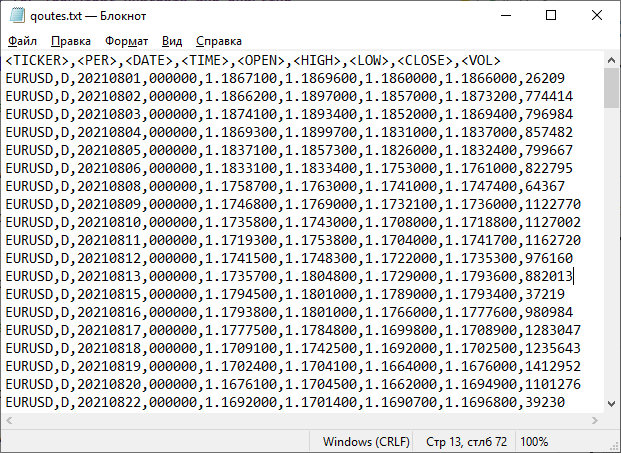
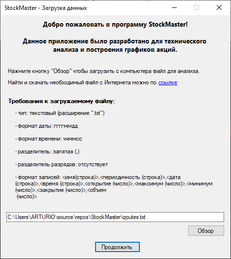
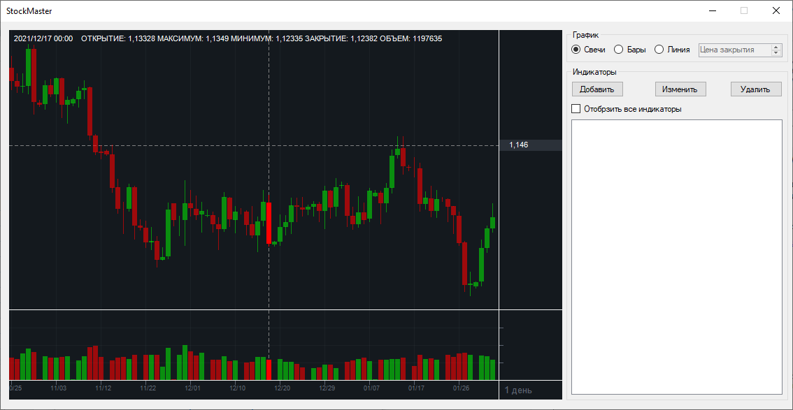
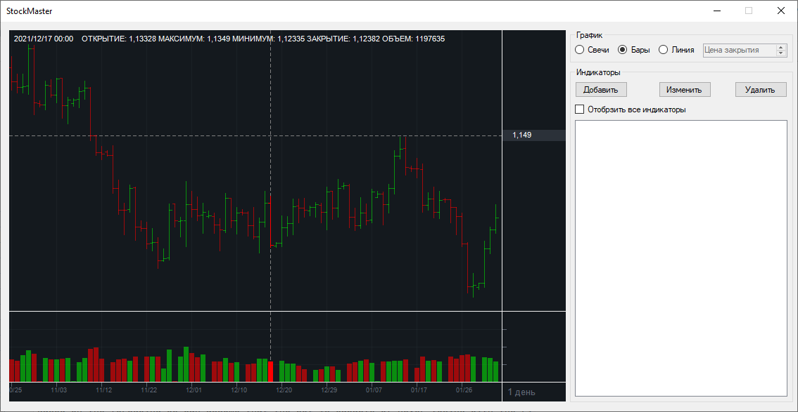
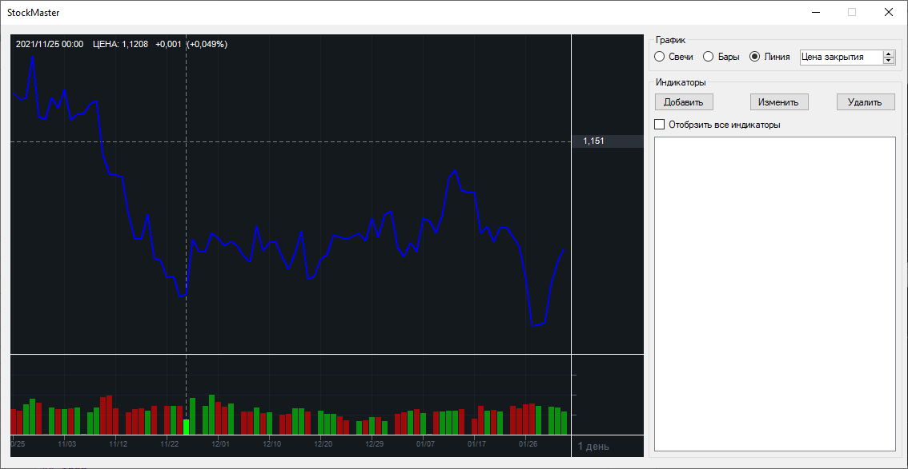
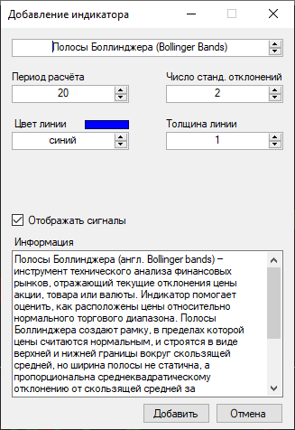
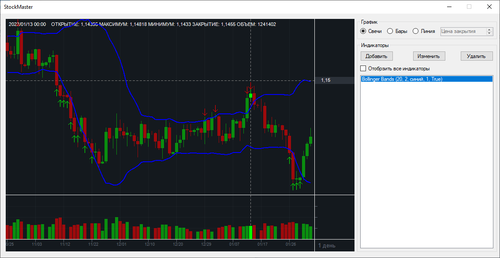

# StockMaster: Soft for Technical Analysis and Charting
___
## Example
1. Data: _[quotes.txt](quotes.txt)_ from _[FINAM](https://www.finam.ru/profile/forex/eur-usd/export/)_.

2. Load file

3. Chart types

4. Adding indicator

5. Chart

